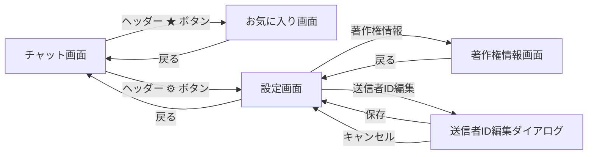

# UI設計書

## 1. 対象画面一覧

| 画面名 | コンポーザブル | ファイル | 区分 |
|---|---|---|---|
| チャット画面 | `ChatScreen` | `ui/ChatScreen.kt` | 既存（変更あり） |
| 設定画面 | `SettingsScreen` | `ui/SettingsScreen.kt` | 既存 |
| 著作権情報画面 | `CopyrightScreen` | `ui/CopyrightScreen.kt` | 既存 |
| お気に入り画面 | `FavoritesScreen` | `ui/FavoritesScreen.kt` | 新規 |

### 関連ファイル

| ファイル | 区分 | 内容 |
|---|---|---|
| `ui/ChatHeader.kt` | 既存（変更あり） | ★ お気に入りボタン・⚙ 設定ボタン |
| `ui/MessageList.kt` | 既存（変更あり） | ★ トグルアイコン付きメッセージバブル |
| `repository/FavoriteRepository.kt` | 新規 | お気に入りの永続化・StateFlow 通知 |
| `MainActivity.kt` | 既存（変更あり） | NavHost（4ルート）、FavoriteRepository 接続 |

---

## 2. 画面遷移



### ルート定義

```kotlin
private object Route {
    const val CHAT      = "chat"
    const val SETTINGS  = "settings"
    const val COPYRIGHT = "copyright"
    const val FAVORITES = "favorites"
}
```

---

## 3. チャット画面の変更

### 3.1 ヘッダー（ChatHeader）

#### 3.1.1 レイアウト

```
┌─────────────────────────────────────────────────┐
│ [● BLE状態]  [👥 N人]  [⟳]  [★]  [⚙]            │
└─────────────────────────────────────────────────┘
```

#### 3.1.2 ボタン仕様

| ボタン | アイコン | 色 | 操作 |
|---|---|---|---|
| お気に入り | `Icons.Filled.Star` | `Color(0xFFFFC107)` アンバー | タップでお気に入り画面へ遷移 |
| 設定 | `Icons.Filled.Settings` | `onPrimaryContainer` | タップで設定画面へ遷移 |

- 右側ボタン配置（左→右）: `[⟳スキャン中]` `[★お気に入り]` `[⚙設定]`

#### 3.1.3 パラメータ変更

```kotlin
// 追加されたパラメータ
onNavigateToFavorites: () -> Unit
```

### 3.2 メッセージバブル（MessageBubble）

#### 3.2.1 ★ アイコンの配置

| メッセージ種別 | ★ アイコン位置 |
|---|---|
| 自分のメッセージ（右寄せ） | 吹き出しの **左側** |
| 相手のメッセージ（左寄せ） | 吹き出しの **右側** |

#### 3.2.2 ★ アイコンの見た目

| 状態 | 色 |
|---|---|
| 未登録 | `onSurfaceVariant` の 30% 透過（薄灰色） |
| 登録済み | `Color(0xFFFFC107)` アンバー |

- アイコン: `Icons.Filled.Star`（サイズ 18.dp）
- タップ領域: 32.dp × 32.dp（`IconButton`）

#### 3.2.3 動作

| 操作 | 結果 |
|---|---|
| 未登録状態の ★ タップ | お気に入りに追加、アイコンがアンバー色に変化 |
| 登録済み状態の ★ タップ | お気に入りから削除、アイコンが薄灰色に変化 |

#### 3.2.4 パラメータ変更

```kotlin
// 追加されたパラメータ（MessageList / MessageBubble）
favoriteIds: Set<String>
onToggleFavorite: (ChatMessage) -> Unit
```

---

## 4. 設定画面（SettingsScreen）

### 4.1 目的

- 端末設定として送信者IDを表示・編集する
- BLE動作に関する設定値を参照表示する
- アプリ情報への導線を提供する

### 4.2 レイアウト構成

- 画面全体は `Scaffold`
- 上部に `TopAppBar`
- 本文は `Column` + `verticalScroll`
- セクションごとに見出しと項目を配置
- 項目間は `HorizontalDivider` で区切る

### 4.3 TopAppBar

| 項目 | 内容 |
|---|---|
| タイトル | `設定` |
| 戻るボタン | 左上に表示、押下で前画面へ戻る |
| 背景色 | `MaterialTheme.colorScheme.primaryContainer` |
| 文字色・アイコン色 | `onPrimaryContainer` |

### 4.4 本文セクション

#### 4.4.1 端末設定セクション

見出し: `端末設定`

| ラベル | 値 | 操作 |
|---|---|---|
| `送信者ID` | `selfId` の現在値 | 右端の編集アイコン押下で編集ダイアログを開く |

#### 4.4.2 BLE設定セクション

見出し: `BLE 設定`

| ラベル | 表示値 | 値の参照元 |
|---|---|---|
| `送信継続時間` | `${BuildConfig.ADVERTISE_DURATION_SEC} 秒` | `BuildConfig.ADVERTISE_DURATION_SEC` |
| `重複排除 TTL` | `${BuildConfig.DUPLICATE_FILTER_TTL_SEC} 秒` | `BuildConfig.DUPLICATE_FILTER_TTL_SEC` |
| `参加者タイムアウト` | `${BuildConfig.PEER_TIMEOUT_SEC} 秒` | `BuildConfig.PEER_TIMEOUT_SEC` |

- いずれも参照表示のみで画面上から編集はしない

#### 4.4.3 アプリ情報セクション

見出し: `アプリ情報`

| ラベル | 値/動作 |
|---|---|
| `バージョン` | `1.0.0` を表示 |
| `著作権情報` | 押下で著作権情報画面へ遷移 |

### 4.5 コンポーネント構成

```text
SettingsScreen
├── Scaffold
│   ├── TopAppBar
│   │   ├── 戻るボタン
│   │   └── タイトル「設定」
│   └── Column (verticalScroll)
│       ├── SettingsSectionHeader「端末設定」
│       ├── SettingsItem「送信者ID」
│       ├── SettingsSectionHeader「BLE 設定」
│       ├── SettingsItem「送信継続時間」
│       ├── SettingsItem「重複排除 TTL」
│       ├── SettingsItem「参加者タイムアウト」
│       ├── SettingsSectionHeader「アプリ情報」
│       ├── SettingsItem「バージョン」
│       └── SettingsNavigationItem「著作権情報」
└── SelfIdEditDialog（条件表示）
```

### 4.6 送信者ID編集ダイアログ

#### 4.6.1 表示条件

- `送信者ID` 行の編集アイコン押下時に表示

#### 4.6.2 ダイアログ構成

| 項目 | 内容 |
|---|---|
| タイトル | `送信者IDを変更` |
| 説明文 | `半角英数字・8文字以内で入力してください。` |
| 入力欄 | `OutlinedTextField` |
| 保存ボタン | `保存` |
| キャンセルボタン | `キャンセル` |

#### 4.6.3 入力仕様

| 項目 | 仕様 |
|---|---|
| 初期値 | 現在の `selfId` |
| 最大文字数 | 8文字 |
| 必須 | 空文字不可 |
| バリデーション | `isNotBlank() && length <= 8` |
| エラー表示 | 不正時に `1〜8文字で入力してください` を表示 |

#### 4.6.4 動作

| 操作 | 結果 |
|---|---|
| 保存 | `onSelfIdChange(newId)` を呼び出してダイアログを閉じる |
| キャンセル | 値を保存せず閉じる |
| ダイアログ外タップ | `onDismiss` を呼び出して閉じる |

### 4.7 状態とUI反映

| 状態 | UI反映 |
|---|---|
| `showEditDialog = false` | 編集ダイアログ非表示 |
| `showEditDialog = true` | 編集ダイアログ表示 |
| 入力値が有効 | 保存ボタン有効 |
| 入力値が無効 | 保存ボタン無効、エラーメッセージ表示 |

---

## 5. 著作権情報画面（CopyrightScreen）

### 5.1 目的

- アプリ自体の著作権情報を表示する
- 利用しているOSSライブラリとライセンス情報を表示する
- Apache License 2.0 の概要と全文リンクを案内する

### 5.2 レイアウト構成

- 画面全体は `Scaffold`
- 上部に `TopAppBar`
- 本文は `Column` + `verticalScroll`
- `Card` を用いて情報ブロックごとに表示

### 5.3 TopAppBar

| 項目 | 内容 |
|---|---|
| タイトル | `著作権情報` |
| 戻るボタン | 左上に表示、押下で設定画面へ戻る |
| 背景色 | `MaterialTheme.colorScheme.primaryContainer` |
| 文字色・アイコン色 | `onPrimaryContainer` |

### 5.4 本文構成

#### 5.4.1 アプリ情報カード

| 項目 | 表示値 |
|---|---|
| アプリ名 | `BLE5 Chat` |
| バージョン | `Version 1.0.0` |
| コピーライト | `Copyright © 2025 moonmile` |
| 説明文 | `BLE5 Extended Advertising を使った近距離ブロードキャストチャットアプリです。` |

- `Card` を使用、背景色は `primaryContainer`
- 内部に `HorizontalDivider` を配置

#### 5.4.2 オープンソースライセンス一覧

見出し: `オープンソースライセンス`
説明文: `本アプリは以下のオープンソースライブラリを使用しています。`

| ライブラリ | バージョン | ライセンス |
|---|---|---|
| Kotlin | `2.0.21` | Apache License 2.0 |
| Kotlinx Coroutines | `1.8.1` | Apache License 2.0 |
| Jetpack Compose | `BOM 2024.09.00` | Apache License 2.0 |
| Compose Material3 | `BOM 2024.09.00` | Apache License 2.0 |
| Navigation Compose | `2.8.9` | Apache License 2.0 |
| AndroidX Core KTX | `1.18.0` | Apache License 2.0 |
| AndroidX Lifecycle | `2.10.0` | Apache License 2.0 |
| AndroidX Activity Compose | `1.13.0` | Apache License 2.0 |

- 各ライブラリを `LibraryCard` で表示、カード背景色は `surfaceVariant`

#### 5.4.3 Apache License 2.0 要約カード

| 項目 | 内容 |
|---|---|
| タイトル | `Apache License 2.0 について` |
| 要約 | 使用・複製・配布・改変・再配布などを条件付きで無償許可 |
| 主な条件 | 著作権表示とライセンス本文保持、改変明記 |
| リンク | `https://www.apache.org/licenses/LICENSE-2.0` |

- `Card` を使用、`outlinedCardBorder()` による枠線付きカード

### 5.5 コンポーネント構成

```text
CopyrightScreen
└── Scaffold
    ├── TopAppBar
    │   ├── 戻るボタン
    │   └── タイトル「著作権情報」
    └── Column (verticalScroll)
        ├── AppInfoCard
        ├── ライセンス一覧見出し
        ├── LibraryCard × 8
        └── LicenseSummaryCard
```

---

## 6. お気に入り画面（FavoritesScreen）

### 6.1 目的

- お気に入り登録したメッセージを一覧表示する
- 左スワイプで表示されるゴミ箱アイコンをタップしてメッセージを削除する

### 6.2 レイアウト構成

- 画面全体は `Scaffold`
- 上部に `TopAppBar`
- 本文は `LazyColumn`（件数0のときは空メッセージを中央表示）
- 各アイテムは `SwipeToRevealDeleteItem` でラップ

### 6.3 TopAppBar

| 項目 | 内容 |
|---|---|
| タイトル | `お気に入り  (N件)` ※ N は登録件数 |
| 戻るボタン | 左上に表示、タップでチャット画面へ戻る |
| 背景色 | `MaterialTheme.colorScheme.primaryContainer` |
| 文字色・アイコン色 | `onPrimaryContainer` |

### 6.4 空状態

- お気に入りが 0 件のときに画面中央に表示する
- 表示文字列: `お気に入りはまだありません`
- スタイル: `bodyMedium` / 色: `onSurfaceVariant`

### 6.5 リストアイテム（FavoriteItem）

各メッセージを `Card`（`surfaceVariant` 背景）で表示する。

| 表示要素 | スタイル / 色 |
|---|---|
| 送信者ID | `labelMedium` / `SemiBold` / `primary` 色 |
| 日時（`MM/dd HH:mm`） | `labelSmall` / `onSurfaceVariant` 色 |
| 本文 | `bodyMedium` / `onSurface` 色 |

- 送信者IDと日時は同一行（`Row`）に並べる
- 本文は下段に配置

### 6.6 スワイプで削除（SwipeToRevealDeleteItem）

#### 6.6.1 動作仕様

| 操作 | 結果 |
|---|---|
| 左スワイプ（開く閾値超え or 高速フリック） | カードが左にスナップし、右端にゴミ箱ボタンが現れる |
| 左スワイプ（閾値未満） | カードが元の位置に戻る（スプリングアニメーション） |
| 右スワイプ / スワイプを戻す | カードが閉じ、ゴミ箱ボタンが隠れる |
| ゴミ箱アイコンをタップ | `onRemove()` が呼ばれ、リストからアイテムが削除される |

#### 6.6.2 スワイプ仕様

| 項目 | 値 |
|---|---|
| スワイプ方向 | 左方向のみ（右方向は閉じる操作） |
| ゴミ箱ボタン幅 | 72.dp |
| スナップ開く閾値 | ゴミ箱幅の 40% 超（28.8.dp） |
| 高速フリック閾値 | 速度 500px/s 以上 |
| スナップアニメーション | `spring(stiffness = Spring.StiffnessMedium)` |
| ドラッグ実装 | `Animatable<Float>` + `Modifier.draggable` |

#### 6.6.3 ゴミ箱ボタン

| 項目 | 内容 |
|---|---|
| アイコン | `Icons.Filled.Delete` |
| 背景色 | `MaterialTheme.colorScheme.errorContainer` |
| アイコン色 | `MaterialTheme.colorScheme.onErrorContainer` |
| 角丸 | 右上・右下 12.dp |
| 高さ | 前景カードと同じ（`matchParentSize()` + `fillMaxHeight()`） |

#### 6.6.4 削除アニメーション

- `LazyColumn` の各アイテムに `.animateItem()` を適用
- 削除時にアイテムがスムーズにリストから消えるアニメーションが再生される

### 6.7 コンポーネント構成

```text
FavoritesScreen
└── Scaffold
    ├── TopAppBar
    │   ├── 戻るボタン
    │   └── タイトル「お気に入り (N件)」
    └── LazyColumn（件数 > 0）/ Box 中央テキスト（件数 0）
        └── SwipeToRevealDeleteItem × N
            ├── 背景層: Box（matchParentSize）
            │   └── Box（width=72.dp, fillMaxHeight, errorContainer 背景）
            │       └── IconButton（ゴミ箱アイコン）
            └── 前景層: Box（offset でスライド, draggable）
                └── FavoriteItem（Card）
                    └── Column
                        ├── Row（送信者ID + 日時）
                        └── Text（本文）
```

---

## 7. データ管理（FavoriteRepository）

### 7.1 概要

| 項目 | 内容 |
|---|---|
| クラス | `FavoriteRepository` |
| 保存先 | `SharedPreferences`（Activity の `getPreferences(MODE_PRIVATE)`） |
| フォーマット | JSON 配列（`org.json.JSONArray`）/ キー: `"favorites"` |
| 公開 API | `StateFlow<List<ChatMessage>> favorites` |

### 7.2 公開メソッド

| メソッド | 引数 | 処理 |
|---|---|---|
| `toggle(message)` | `ChatMessage` | 登録済みなら削除、未登録なら追加。SharedPreferences に即時保存 |
| `remove(messageId)` | `String` | 指定 ID を削除。SharedPreferences に即時保存 |
| `isFavorite(messageId)` | `String` | 登録済みかどうかを返す |

### 7.3 永続化フォーマット（JSON）

```json
[
  {
    "messageId": "xxxxxxxx-xxxx-xxxx-xxxx-xxxxxxxxxxxx",
    "senderId":  "abc12345",
    "timestamp": 1700000000000,
    "text":      "メッセージ本文"
  }
]
```

### 7.4 MainActivity での接続

```kotlin
// MainActivity.setContent { ... } 内
val favorites   by favoriteRepository.favorites.collectAsState()
val favoriteIds  = favorites.map { it.messageId }.toSet()

// ChatScreen へ渡す
ChatScreen(
    favoriteIds           = favoriteIds,
    onToggleFavorite      = { msg -> favoriteRepository.toggle(msg) },
    onNavigateToFavorites = { navController.navigate(Route.FAVORITES) }
)

// FavoritesScreen へ渡す
FavoritesScreen(
    favorites  = favorites,
    onRemove   = { id -> favoriteRepository.remove(id) }
)
```

---

## 8. 共通UI仕様

| 項目 | 内容 |
|---|---|
| デザインシステム | Material 3 |
| スクロール | 設定・著作権画面は縦スクロール対応 |
| 余白 | 主に `12.dp` / `16.dp` 基準 |
| 区切り線 | `HorizontalDivider` を利用（設定画面） |
| アニメーション | スナップは `spring`、削除は `animateItem()` |
| 戻る操作 | TopAppBar 左上の戻るアイコン（チャット画面以外） |
| TopAppBar 配色 | 全画面共通で `primaryContainer` / `onPrimaryContainer` |

---

## 9. 実装上の注意点

- **スワイプ実装**: `AnchoredDraggableState`（experimental API）は Compose BOM バージョンによって API シグネチャが異なるため、`Animatable<Float>` + `Modifier.draggable` の組み合わせで実装している
- **背景層の高さ**: `SwipeToRevealDeleteItem` の背景層は `matchParentSize()` + `fillMaxHeight()` で前景カードの高さに追従させる。`fillMaxHeight()` 単独では LazyColumn 内で高さが不定になる
- **SharedPreferences キー競合**: `FavoriteRepository` のキー `"favorites"` は `selfId` キーと衝突しない。どちらも同一の `getPreferences(MODE_PRIVATE)` を使用する
- **★ の即時同期**: お気に入り追加・削除は `StateFlow` 経由でチャット画面・お気に入り画面の両方に即時反映される
- **設定画面の BLE 設定値**: `BuildConfig` を参照する（編集不可）
- **バージョン表示**: 現在 `1.0.0` 固定表示（`BuildConfig.VERSION_NAME` 未使用）
- **著作権情報画面のライブラリ一覧**: `libraries` 定数リストとして CopyrightScreen.kt 内に定義

---

## 10. 今後の拡張候補

- バージョン表示を `BuildConfig.VERSION_NAME` に統一する
- スワイプ中のゴミ箱ボタン背景色をオフセット量に応じてアニメーションする（透明 → errorContainer）
- お気に入りの並び順変更（登録日時順 / 送信者順）
- お気に入りのキーワード検索
- お気に入りのエクスポート機能（テキスト共有など）
- Room Database への移行（件数が多くなった場合の SharedPreferences 代替）
- 送信者IDの入力制約を「半角英数字のみ」でコード上も厳密に検証する
- ライブラリ一覧を Gradle 依存関係や OSS ライセンス生成ツールから自動生成する
- Apache License 2.0 の全文を WebView あるいはブラウザ起動で表示する
