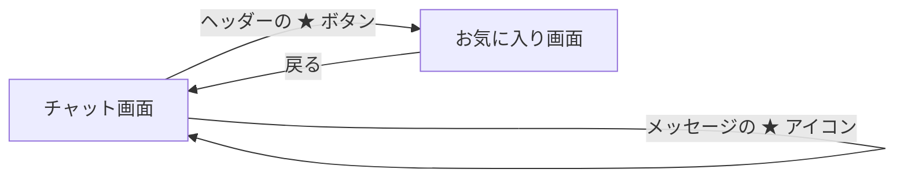

# UI設計書: お気に入り機能

## 1. 対象画面・コンポーネント

### 新規追加

| 画面/ファイル | 実装クラス/関数 |
|---|---|
| お気に入り画面 | `FavoritesScreen` |
| `src/app/src/main/java/net/moonmile/ble5_chat/claude/ui/FavoritesScreen.kt` | |
| お気に入りリポジトリ | `FavoriteRepository` |
| `src/app/src/main/java/net/moonmile/ble5_chat/claude/repository/FavoriteRepository.kt` | |

### 既存画面の変更

| 画面/ファイル | 変更内容 |
|---|---|
| `ChatHeader.kt` | ★ ボタン追加（お気に入り画面へのナビゲーション） |
| `MessageList.kt` | 各メッセージバブルに ★ トグルアイコン追加 |
| `ChatScreen.kt` | `favoriteIds`・`onToggleFavorite`・`onNavigateToFavorites` パラメータ追加 |
| `MainActivity.kt` | `FavoriteRepository` の初期化・`Route.FAVORITES` 追加・NavHost への組み込み |

---

## 2. 画面遷移



- チャット画面のヘッダーに常時表示される ★ ボタンから遷移する
- お気に入りへの追加・解除はチャット画面を離れずに行える

---

## 3. チャット画面の変更

### 3.1 ヘッダー（ChatHeader）

#### 3.1.1 追加要素

| 項目 | 内容 |
|---|---|
| アイコン | `Icons.Filled.Star` |
| 色 | `Color(0xFFFFC107)`（アンバー） |
| 配置 | 設定アイコン（⚙）の左隣 |
| 操作 | タップでお気に入り画面へ遷移 |

#### 3.1.2 ヘッダーボタン配置（右側）

```text
[⟳ スキャン中] [★ お気に入り] [⚙ 設定]
```

### 3.2 メッセージバブル（MessageBubble）

#### 3.2.1 ★ トグルアイコンの配置

| メッセージ種別 | ★ アイコンの位置 |
|---|---|
| 自分のメッセージ（右寄せ） | 吹き出しの **左側** |
| 相手のメッセージ（左寄せ） | 吹き出しの **右側** |

#### 3.2.2 ★ アイコンの見た目

| 状態 | 色 |
|---|---|
| お気に入り未登録 | `onSurfaceVariant` の 30% 透過（薄灰色） |
| お気に入り登録済み | `Color(0xFFFFC107)`（アンバー） |

- アイコンサイズ: 18.dp
- タップ領域: 32.dp × 32.dp（`IconButton`）

#### 3.2.3 動作

| 操作 | 結果 |
|---|---|
| 未登録状態の ★ タップ | お気に入りに追加、アイコンがアンバー色に変化 |
| 登録済み状態の ★ タップ | お気に入りから削除、アイコンが薄灰色に変化 |

### 3.3 パラメータ変更（ChatScreen / ChatHeader）

#### ChatScreen に追加されたパラメータ

| パラメータ | 型 | 用途 |
|---|---|---|
| `favoriteIds` | `Set<String>` | 登録済みメッセージIDの集合（バブル表示に使用） |
| `onToggleFavorite` | `(ChatMessage) -> Unit` | ★ タップ時のコールバック |
| `onNavigateToFavorites` | `() -> Unit` | ヘッダー ★ タップ時の遷移コールバック |

#### ChatHeader に追加されたパラメータ

| パラメータ | 型 | 用途 |
|---|---|---|
| `onNavigateToFavorites` | `() -> Unit` | ★ ボタン押下時のコールバック |

---

## 4. お気に入り画面（FavoritesScreen）

### 4.1 目的

- お気に入り登録したメッセージを一覧表示する
- メッセージを左スワイプして表示されるゴミ箱アイコンをタップして削除する

### 4.2 レイアウト構成

- 画面全体は `Scaffold`
- 上部に `TopAppBar`
- 本文は `LazyColumn`（件数0のときは空メッセージを中央表示）
- 各アイテムは `SwipeToRevealDeleteItem` でラップ

### 4.3 TopAppBar

| 項目 | 内容 |
|---|---|
| タイトル | `お気に入り  (N件)` ※ N は登録件数 |
| 戻るボタン | 左上に表示、タップでチャット画面へ戻る |
| 背景色 | `MaterialTheme.colorScheme.primaryContainer` |
| 文字色・アイコン色 | `onPrimaryContainer` |

### 4.4 空状態

- お気に入りが0件のときに画面中央に表示する
- 表示文字列: `お気に入りはまだありません`
- スタイル: `bodyMedium`、色: `onSurfaceVariant`

### 4.5 リストアイテム（FavoriteItem）

各メッセージを `Card`（`surfaceVariant` 背景）で表示する。

| 表示要素 | 内容 |
|---|---|
| 送信者ID | `labelMedium` / `SemiBold` / `primary` 色 |
| 日時 | `MM/dd HH:mm` 形式 / `labelSmall` / `onSurfaceVariant` 色 |
| 本文 | `bodyMedium` / `onSurface` 色 |

送信者IDと日時は同一行（Row）に並べる。本文は下段に配置。

### 4.6 スワイプで削除（SwipeToRevealDeleteItem）

#### 4.6.1 動作仕様

| 操作 | 結果 |
|---|---|
| 左スワイプ（開く閾値超え or 高速フリック） | カードが左にスナップし、右端にゴミ箱ボタンが現れる |
| 左スワイプ（閾値未満） | カードが元の位置に戻る（スプリングアニメーション） |
| 右スワイプ / スワイプを戻す | カードが閉じ、ゴミ箱ボタンが隠れる |
| ゴミ箱アイコンをタップ | `onRemove()` が呼ばれ、リストからアイテムが削除される |

#### 4.6.2 スワイプ仕様

| 項目 | 値 |
|---|---|
| スワイプ方向 | 左方向のみ（右方向は閉じる操作） |
| ゴミ箱ボタン幅 | 72.dp |
| スナップ開く閾値 | ゴミ箱幅の 40% 超（28.8.dp） |
| 高速フリック閾値 | 速度 500px/s 以上 |
| スナップアニメーション | `spring(stiffness = Spring.StiffnessMedium)` |
| ドラッグアニメーション | `Animatable<Float>` + `draggable` |

#### 4.6.3 ゴミ箱ボタン

| 項目 | 内容 |
|---|---|
| アイコン | `Icons.Filled.Delete` |
| 背景色 | `MaterialTheme.colorScheme.errorContainer` |
| アイコン色 | `MaterialTheme.colorScheme.onErrorContainer` |
| 角丸 | 右上・右下 12.dp（`RoundedCornerShape(topEnd, bottomEnd)`） |
| 高さ | 前景カードと同じ高さ（`matchParentSize()` + `fillMaxHeight()`） |

#### 4.6.4 削除アニメーション

- `LazyColumn` の各アイテムに `.animateItem()` を適用
- 削除時にアイテムが自然にリストから消えるアニメーションが再生される

### 4.7 コンポーネント構成

```text
FavoritesScreen
└── Scaffold
    ├── TopAppBar
    │   ├── 戻るボタン
    │   └── タイトル「お気に入り (N件)」
    └── LazyColumn（件数 > 0 のとき）/ Box 中央テキスト（件数 0 のとき）
        └── SwipeToRevealDeleteItem × N
            ├── 背景層: Box（matchParentSize）
            │   └── Box（width=72.dp, fillMaxHeight, errorContainer 背景）
            │       └── IconButton（ゴミ箱アイコン）
            └── 前景層: Box（offset でスライド, draggable）
                └── FavoriteItem（Card）
                    └── Column
                        ├── Row（送信者ID + 日時）
                        └── Text（本文）
```

---

## 5. データ管理（FavoriteRepository）

### 5.1 概要

| 項目 | 内容 |
|---|---|
| クラス | `FavoriteRepository` |
| 保存先 | `SharedPreferences`（Activity の `getPreferences(MODE_PRIVATE)`） |
| フォーマット | JSON 配列（`org.json.JSONArray`）/ キー: `"favorites"` |
| 公開 API | `StateFlow<List<ChatMessage>> favorites` |

### 5.2 公開メソッド

| メソッド | 引数 | 処理 |
|---|---|---|
| `toggle(message)` | `ChatMessage` | 登録済みなら削除、未登録なら追加。SharedPreferences に即時保存 |
| `remove(messageId)` | `String` | 指定 ID を削除。SharedPreferences に即時保存 |
| `isFavorite(messageId)` | `String` | 登録済みかどうかを返す |

### 5.3 永続化フォーマット（JSON）

```json
[
  {
    "messageId": "xxxxxxxx-xxxx-xxxx-xxxx-xxxxxxxxxxxx",
    "senderId":  "abc12345",
    "timestamp": 1700000000000,
    "text":      "メッセージ本文"
  }
]
```

### 5.4 MainActivity での接続

```
MainActivity
├── favoriteRepository: FavoriteRepository（lazy 初期化）
├── setContent {
│   ├── val favorites by favoriteRepository.favorites.collectAsState()
│   ├── val favoriteIds = favorites.map { it.messageId }.toSet()
│   ├── ChatScreen(
│   │   favoriteIds      = favoriteIds,
│   │   onToggleFavorite = { msg -> favoriteRepository.toggle(msg) },
│   │   onNavigateToFavorites = { navController.navigate(Route.FAVORITES) }
│   │   )
│   └── FavoritesScreen(
│       favorites  = favorites,
│       onRemove   = { id -> favoriteRepository.remove(id) }
│       )
└── }
```

---

## 6. ルート定義（Route）

```kotlin
private object Route {
    const val CHAT      = "chat"
    const val SETTINGS  = "settings"
    const val COPYRIGHT = "copyright"
    const val FAVORITES = "favorites"   // 今回追加
}
```

---

## 7. 共通UI仕様

| 項目 | 内容 |
|---|---|
| デザインシステム | Material 3 |
| 余白 | 主に `12.dp` / `16.dp` 基準 |
| アニメーション | スナップは `spring`、削除は `animateItem()` |
| 戻る操作 | TopAppBar 左上の戻るアイコン |

---

## 8. 実装上の注意点

- `SwipeToRevealDeleteItem` の背景層は `matchParentSize()` で前景カードの高さに追従させる。`fillMaxHeight()` 単独では LazyColumn 内で高さが不定になる場合があるため `matchParentSize()` と組み合わせて使用する
- `AnchoredDraggableState`（experimental API）は Compose BOM バージョンによって API シグネチャが異なるため、`Animatable` + `draggable` の組み合わせで実装している
- `FavoriteRepository` は `MainActivity` の `prefs`（`getPreferences(MODE_PRIVATE)`）を共有する。キー `"favorites"` は `selfId` キーと衝突しない
- お気に入りデータはアプリ終了後も保持される（SharedPreferences による永続化）
- チャット画面を離れてお気に入りを削除した場合、チャット画面の ★ 表示も `StateFlow` 経由で即時同期される

---

## 9. 今後の拡張候補

- スワイプ中のゴミ箱ボタン背景色をオフセット量に応じてアニメーションする（透明 → errorContainer へのグラデーション）
- お気に入りの並び順変更（登録日時順 / 送信者順）
- お気に入りのキーワード検索
- お気に入りのエクスポート機能（テキスト共有など）
- Room Database への移行（件数が多くなった場合の SharedPreferences 代替）
