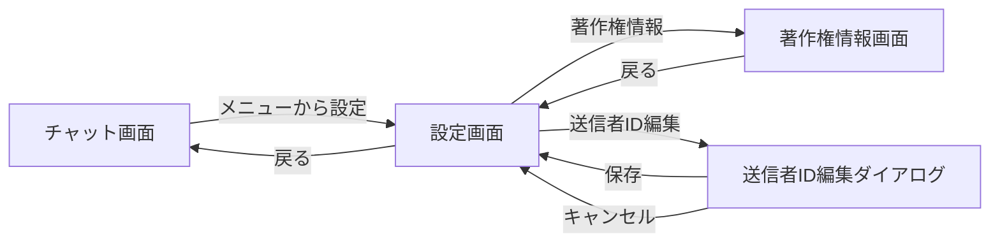

# UI設計書: 設定画面 / 著作権情報画面

## 1. 対象画面

- 設定画面
  - 実装: `SettingsScreen`
  - ファイル: `src/app/src/main/java/net/moonmile/ble5_chat/claude/ui/SettingsScreen.kt`
- 著作権情報画面
  - 実装: `CopyrightScreen`
  - ファイル: `src/app/src/main/java/net/moonmile/ble5_chat/claude/ui/CopyrightScreen.kt`

## 2. 画面遷移



## 3. 設定画面

### 3.1 目的

- 端末設定として送信者IDを表示・編集する
- BLE動作に関する設定値を参照表示する
- アプリ情報への導線を提供する

### 3.2 レイアウト構成

- 画面全体は `Scaffold`
- 上部に `TopAppBar`
- 本文は `Column` + `verticalScroll`
- セクションごとに見出しと項目を配置
- 項目間は `HorizontalDivider` で区切る

### 3.3 TopAppBar

| 項目 | 内容 |
|---|---|
| タイトル | `設定` |
| 戻るボタン | 左上に表示、押下で前画面へ戻る |
| 背景色 | `MaterialTheme.colorScheme.primaryContainer` |
| 文字色・アイコン色 | `onPrimaryContainer` |

### 3.4 本文セクション

#### 3.4.1 端末設定セクション

見出し:
- `端末設定`

項目:

| ラベル | 値 | 操作 |
|---|---|---|
| `送信者ID` | `selfId` の現在値 | 右端の編集アイコン押下で編集ダイアログを開く |

#### 3.4.2 BLE設定セクション

見出し:
- `BLE 設定`

項目:

| ラベル | 表示値 | 値の参照元 |
|---|---|---|
| `送信継続時間` | `${BuildConfig.ADVERTISE_DURATION_SEC} 秒` | `BuildConfig.ADVERTISE_DURATION_SEC` |
| `重複排除 TTL` | `${BuildConfig.DUPLICATE_FILTER_TTL_SEC} 秒` | `BuildConfig.DUPLICATE_FILTER_TTL_SEC` |
| `参加者タイムアウト` | `${BuildConfig.PEER_TIMEOUT_SEC} 秒` | `BuildConfig.PEER_TIMEOUT_SEC` |

備考:
- いずれも参照表示のみで、画面上から編集はしない

#### 3.4.3 アプリ情報セクション

見出し:
- `アプリ情報`

項目:

| ラベル | 値/動作 |
|---|---|
| `バージョン` | `1.0.0` を表示 |
| `著作権情報` | 押下で著作権情報画面へ遷移 |

### 3.5 設定画面コンポーネント構成

```text
SettingsScreen
├── Scaffold
│   ├── TopAppBar
│   │   ├── 戻るボタン
│   │   └── タイトル「設定」
│   └── Column (verticalScroll)
│       ├── SettingsSectionHeader「端末設定」
│       ├── SettingsItem「送信者ID」
│       ├── SettingsSectionHeader「BLE 設定」
│       ├── SettingsItem「送信継続時間」
│       ├── SettingsItem「重複排除 TTL」
│       ├── SettingsItem「参加者タイムアウト」
│       ├── SettingsSectionHeader「アプリ情報」
│       ├── SettingsItem「バージョン」
│       └── SettingsNavigationItem「著作権情報」
└── SelfIdEditDialog（条件表示）
```

### 3.6 送信者ID編集ダイアログ

#### 3.6.1 表示条件

- `送信者ID` 行の編集アイコン押下時に表示

#### 3.6.2 ダイアログ構成

| 項目 | 内容 |
|---|---|
| タイトル | `送信者IDを変更` |
| 説明文 | `半角英数字・8文字以内で入力してください。` |
| 入力欄 | `OutlinedTextField` |
| 保存ボタン | `保存` |
| キャンセルボタン | `キャンセル` |

#### 3.6.3 入力仕様

| 項目 | 仕様 |
|---|---|
| 初期値 | 現在の `selfId` |
| 最大文字数 | 8文字 |
| 必須 | 空文字不可 |
| バリデーション | `isNotBlank() && length <= 8` |
| エラー表示 | 不正時に `1?8文字で入力してください` を表示 |

#### 3.6.4 動作

| 操作 | 結果 |
|---|---|
| 保存 | `onSelfIdChange(newId)` を呼び出してダイアログを閉じる |
| キャンセル | 値を保存せず閉じる |
| ダイアログ外タップ/戻る | `onDismiss` を呼び出して閉じる |

### 3.7 状態とUI反映

| 状態 | UI反映 |
|---|---|
| `showEditDialog = false` | 編集ダイアログ非表示 |
| `showEditDialog = true` | 編集ダイアログ表示 |
| 入力値が有効 | 保存ボタン有効 |
| 入力値が無効 | 保存ボタン無効、エラーメッセージ表示 |

## 4. 著作権情報画面

### 4.1 目的

- アプリ自体の著作権情報を表示する
- 利用しているOSSライブラリとライセンス情報を表示する
- Apache License 2.0 の概要と全文リンクを案内する

### 4.2 レイアウト構成

- 画面全体は `Scaffold`
- 上部に `TopAppBar`
- 本文は `Column` + `verticalScroll`
- `Card` を用いて情報ブロックごとに表示

### 4.3 TopAppBar

| 項目 | 内容 |
|---|---|
| タイトル | `著作権情報` |
| 戻るボタン | 左上に表示、押下で設定画面へ戻る |
| 背景色 | `MaterialTheme.colorScheme.primaryContainer` |
| 文字色・アイコン色 | `onPrimaryContainer` |

### 4.4 本文構成

#### 4.4.1 アプリ情報カード

表示内容:

| 項目 | 表示値 |
|---|---|
| アプリ名 | `BLE5 Chat` |
| バージョン | `Version 1.0.0` |
| コピーライト | `Copyright c 2025 moonmile` |
| 説明文 | `BLE5 Extended Advertising を使った近距離ブロードキャストチャットアプリです。` |

表示仕様:
- `Card` を使用
- 背景色は `primaryContainer`
- 内部に `HorizontalDivider` を配置

#### 4.4.2 オープンソースライセンス一覧

見出し:
- `オープンソースライセンス`

説明文:
- `本アプリは以下のオープンソースライブラリを使用しています。`

表示対象ライブラリ:

| ライブラリ | バージョン | ライセンス |
|---|---|---|
| Kotlin | `2.0.21` | Apache License 2.0 |
| Kotlinx Coroutines | `1.8.1` | Apache License 2.0 |
| Jetpack Compose | `BOM 2024.09.00` | Apache License 2.0 |
| Compose Material3 | `BOM 2024.09.00` | Apache License 2.0 |
| Navigation Compose | `2.8.9` | Apache License 2.0 |
| AndroidX Core KTX | `1.18.0` | Apache License 2.0 |
| AndroidX Lifecycle | `2.10.0` | Apache License 2.0 |
| AndroidX Activity Compose | `1.13.0` | Apache License 2.0 |

表示仕様:
- 各ライブラリを `LibraryCard` で表示
- カード背景色は `surfaceVariant`
- 1件ごとに以下を表示
  - ライブラリ名
  - バージョン
  - ライセンス名
  - 著作権表示

#### 4.4.3 Apache License 2.0 要約カード

表示内容:

| 項目 | 内容 |
|---|---|
| タイトル | `Apache License 2.0 について` |
| 要約 | 使用・複製・配布・改変・再配布などを条件付きで無償許可 |
| 主な条件 | 著作権表示とライセンス本文保持、改変明記 |
| リンク | `https://www.apache.org/licenses/LICENSE-2.0` |

表示仕様:
- `Card` を使用
- `outlinedCardBorder()` による枠線付きカード

### 4.5 著作権情報画面コンポーネント構成

```text
CopyrightScreen
└── Scaffold
    ├── TopAppBar
    │   ├── 戻るボタン
    │   └── タイトル「著作権情報」
    └── Column (verticalScroll)
        ├── AppInfoCard
        ├── ライセンス一覧見出し
        ├── LibraryCard × N
        └── LicenseSummaryCard
```

## 5. 共通UI仕様

| 項目 | 内容 |
|---|---|
| デザインシステム | Material 3 |
| スクロール | 両画面とも縦スクロール対応 |
| 余白 | 主に `16.dp` 基準 |
| 区切り線 | `HorizontalDivider` を利用 |
| 戻る操作 | TopAppBar 左上の戻るアイコン |

## 6. 実装上の注意点

- 設定画面の BLE 設定値は `BuildConfig` を参照する
- 設定画面のバージョン表示は現在 `1.0.0` 固定表示
- 著作権情報画面のアプリ名、バージョン、コピーライト年、ライブラリ一覧はコード内の固定データを表示している
- ライブラリ一覧は `libraries` 定数リストを元に描画される

## 7. 今後の拡張候補

- バージョン表示を `BuildConfig.VERSION_NAME` に統一する
- ライブラリ一覧を Gradle 依存関係や OSS ライセンス生成ツールから自動生成する
- 送信者IDの入力制約を「半角英数字のみ」でコード上も厳密に検証する
- Apache License 2.0 の全文を WebView あるいはブラウザ起動で表示する


