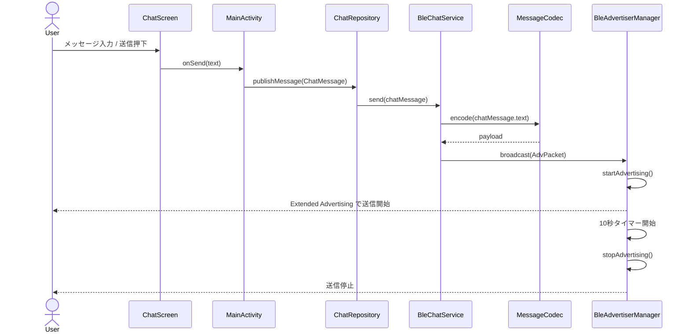
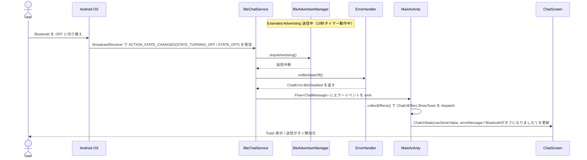
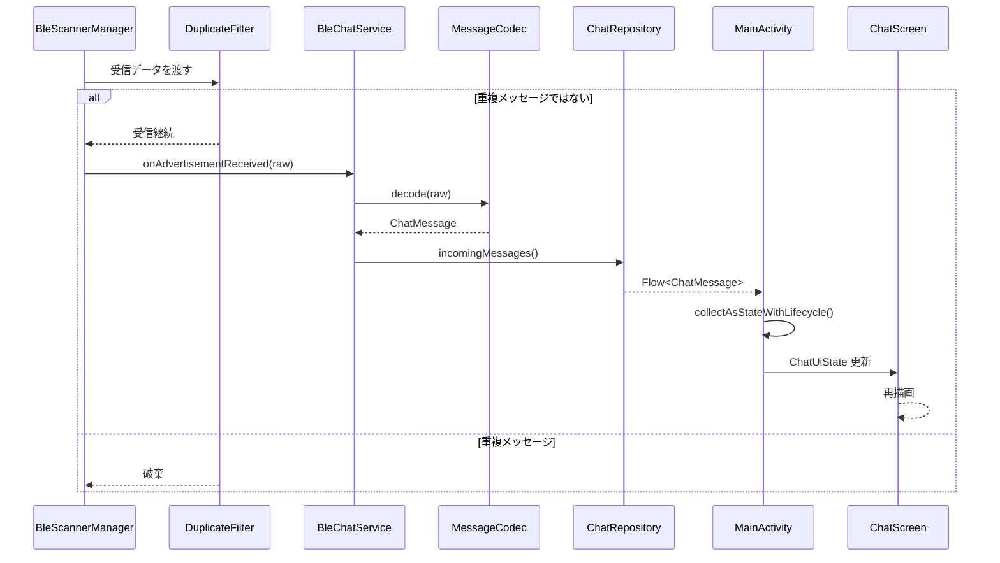
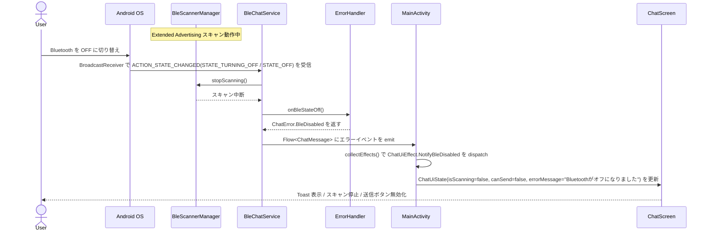

# 概要設計

## 機能要件

- BLE5 の Extended Advertising を利用して、Android 端末同士でチャットができる
- チャットの内容は、テキストメッセージとする
- iBeacon のようにブロードキャストでメッセージを送信し、受信側はそれを受け取って表示する
- ブロードキャスト送信は 10 秒間継続し、その後自動的に停止する
- BLE5 通信の届く範囲内であれば、複数の端末が同時にチャットに参加できる

## 非機能要件

- アプリは Android 10 以降で動作すること
- ユーザーインターフェースはシンプルで直感的なものとする
- 通信の安定性を確保するため、エラーハンドリングを適切に行うこと
- テスト工程を自動化するため、ログ取得や単体テスト、結合テストの自動化を目指す  

## クラス設計

BLE Extended Advertising を使った「ブロードキャスト型チャット」を成立させるため、責務を以下のように分離する。

### 1. クラス一覧

| クラス名 | 種別 | 主な責務 |
|---|---|---|
| MainActivity | UI Host | Compose エントリポイント、`setContent`、UI 状態管理、ライフサイクル連携 |
| ChatScreen | UI Compose | 純粋な描画（State を受け取りコールバックを呼ぶ） |
| ChatRepository | Domain/Application | 送受信ユースケース統合、履歴の仲介（IF） |
| ChatRepositoryImpl | Data | `BleChatService` を使った Repository 実装 |
| BleChatService | BLE Facade | BLE 初期化、Advertiser/Scanner の開始停止管理 |
| BleAdvertiserManager | BLE Tx | Extended Advertising によるメッセージ送出 |
| BleScannerManager | BLE Rx | 広告パケット受信、重複排除 |
| MessageCodec | Protocol | 文字列とバイト列の変換（最大 100 文字制約含む） |
| DispatcherProvider | Concurrency | Coroutine Dispatcher の抽象化（テスト差し替え用） |
| DuplicateFilter | Reliability | MessageId による重複受信抑止 |
| PeerRegistry | Session | 参加端末の最終受信時刻管理（参加者把握） |
| ChatMessage | Model | チャット本文、送信者 ID、時刻、MessageId |
| AdvPacket | Model | 1広告単位データ（MessageId、Seq、Total、Payload） |
| ChatUiState | UI Model | Compose 描画用状態（メッセージ、入力値、送信可否、エラー） |
| ChatUiEvent | UI Model | UI 操作イベント（送信、入力更新、開始、停止） |
| ChatUiEffect | UI Model | 1回性イベント（Toast、権限要求誘導） |
| AppLogger | Cross-cutting | ログ収集（テスト・障害解析用） |
| ErrorHandler | Cross-cutting | BLE 例外、権限エラー、BLE OFF 検知、復旧リトライ判断 |

### 2. 主要クラス詳細

#### MainActivity / ChatScreen
- 責務
	- `MainActivity`: `setContent` と画面ホスト、縦置き（ポートレート）固定
	- `MainActivity`: `ChatRepository` の Flow を `collectAsStateWithLifecycle()` で収集し `ChatUiState` を保持
	- `ChatScreen`: `ChatUiState` を受け取って描画し、コールバック経由で `MainActivity` へ操作を通知
- 主なメソッド
	- `MainActivity.onCreate()`
	- `MainActivity.collectEffects()`
	- `ChatScreen(state: ChatUiState, onSend: (String) -> Unit, onStart: () -> Unit, onStop: () -> Unit, modifier: Modifier = Modifier)`

#### 画面構成（ポートレート固定）
- 画面を 3 領域で固定レイアウトする
	- ヘッダ: BLE 状態、参加者数、スキャン中表示
	- メッセージ領域: `LazyColumn` で時系列表示
	- 入力領域: `TextField` + 送信ボタン
- 横画面向けの分割レイアウトは設けない

#### ChatRepository
- 責務
	- 送信リクエストを BLE 送信経路へ渡す（IF）
	- BLE 受信イベントをドメインモデル `ChatMessage` に変換（IF）
	- テスト時に Fake 実装へ差し替える境界
- 主なメソッド
	- `publishMessage(message: ChatMessage)`
	- `observeMessages(): Flow<ChatMessage>`

#### ChatRepositoryImpl
- 責務
	- `BleChatService` を使った本番実装
	- `ErrorHandler` を通じてドメインエラーへ変換
- 主なメソッド
	- `publishMessage(message: ChatMessage)`
	- `observeMessages(): Flow<ChatMessage>`

#### BleChatService
- 責務
	- `BleAdvertiserManager` と `BleScannerManager` を統合
	- BLE 権限・Adapter 状態を監視
	- アプリの開始/停止に追従して送受信を制御
	- `BroadcastReceiver` で `ACTION_STATE_CHANGED` を受信し、`STATE_TURNING_OFF` / `STATE_OFF` を検知したら送受信を即時中断して `ErrorHandler` へ委譲する
	- BLE OFF 検知時は `ChatUiState.canSend = false` と `ChatUiEffect.ShowToast` を上位へ通知する
- 主なメソッド
	- `start()`
	- `stop()`
	- `send(chatMessage: ChatMessage)`
	- `incomingMessages(): Flow<ChatMessage>`
	- `onBleAdapterStateChanged(state: Int)` ※ BroadcastReceiver から呼ばれる内部ハンドラ

#### BleAdvertiserManager
- 責務
	- メッセージを Extended Advertising で送信（100 文字以内のため 1 パケットに収まる）
	- 送信開始から 10 秒後に自動停止する（タイムアウト制御）
	- パケット送信間隔の制御
- 主なメソッド
	- `startAdvertising()`
	- `stopAdvertising()`
	- `broadcast(packet: AdvPacket)` ※内部で 10 秒タイマーを起動し期限後に `stopAdvertising()` を呼ぶ

#### BleScannerManager
- 責務
	- Extended Advertising をスキャン
	- `DuplicateFilter` で重複排除
	- 受信パケットをそのまま `ChatRepository` へ渡す（分割なし）
- 主なメソッド
	- `startScanning()`
	- `stopScanning()`
	- `onAdvertisementReceived(raw: ByteArray)`

#### DispatcherProvider
- 責務
	- `IO` / `Default` / `Main` Dispatcher を抽象化
	- 単体テストで `StandardTestDispatcher` に差し替え可能にする
- 主なメソッド
	- `io(): CoroutineDispatcher`
	- `default(): CoroutineDispatcher`
	- `main(): CoroutineDispatcher`

### 3. データモデル

#### ChatMessage
- `messageId: String`
- `senderId: String`
- `timestamp: Long`
- `text: String`

#### AdvPacket
- `messageId: String`
- `payload: ByteArray`（最大 100 文字分のエンコード済みバイト列）
- `sentAt: Long`

#### ChatUiState
- `messages: List<ChatMessage>`
- `inputText: String`
- `canSend: Boolean`
- `isScanning: Boolean`
- `errorMessage: String?`

#### ChatUiEvent
- `OnInputChanged(text: String)` （100 文字超は入力時に切り捨て）
- `OnSendClicked`
- `OnStartChat`
- `OnStopChat`

#### ChatUiEffect
- `ShowToast(message: String)`
- `RequestBluetoothPermission`
- `NotifyBleDisabled` ※ BLE が送信中に OFF になった際に発行し、Toast 表示と `canSend=false` 遷移を促す

### 4. 機能要件との対応

1. BLE5 Extended Advertising でチャット
	 - `BleAdvertiserManager` / `BleScannerManager` / `BleChatService` が担当
2. テキストメッセージ送受信
	 - `ChatMessage` + `MessageCodec` が担当
3. ブロードキャスト配信（iBeacon 的利用）
	 - `BleAdvertiserManager.broadcast()` が担当
4. 複数端末同時参加
	 - `PeerRegistry` で参加者状態管理、`DuplicateFilter` で多重受信抑止

### 5. クラス間の基本フロー（送信）

1. `ChatScreen` の `onSend` コールバックが `MainActivity` へテキストを渡す
2. `MainActivity` が `ChatRepository.publishMessage()` を呼ぶ
3. `MessageCodec` でバイト列化（100 文字以内のため 1 パケット）
4. `BleAdvertiserManager.broadcast()` が Extended Advertising で送信
5. 10 秒後にタイマーが発火し `BleAdvertiserManager.stopAdvertising()` を自動呼び出し

### 6. クラス間の基本フロー（受信）

1. `BleScannerManager` が広告データを受信
2. `DuplicateFilter` が重複確認
3. `MessageCodec` で文字列化（1 パケット = 1 メッセージ）
4. `ChatRepository.observeMessages()` の Flow を `MainActivity` が `collectAsStateWithLifecycle()` で収集し `ChatScreen` が再描画

### 7. テストしやすい方式（Compose 前提）

1. UI を「Activity（ホスト）」と「Screen（描画）」に分離する
	- `ChatScreen` は副作用を持たない pure composable とし、スナップショット/表示ロジックの検証を容易にする
2. 画面はポートレート固定としてテスト軸を単純化する
	- UI テストは縦置きレイアウトのみを対象にし、ケースの重複を減らす
3. Repository をインターフェース化する
	- `FakeChatRepository` で BLE なしに `MainActivity` の状態収集テストを実行できる
4. Dispatcher を抽象化する
	- `DispatcherProvider` を使い、テストで時間制御可能な Dispatcher に差し替える
5. 1回性イベントは State ではなく Effect で扱う
	- Toast や権限要求は `ChatUiEffect` で検証し、再コンポーズ時の多重実行を防ぐ
6. 100 文字制約を `MessageCodec` 単体テストで保証する
	- 境界値（100 文字・101 文字）のエンコード結果を検証する


## シーケンス図

### 1. メッセージ送信



### 2. メッセージ送信中に BLE OFF



### 3. メッセージ受信



### 4. メッセージ受信中に BLE OFF



## UI 設計

### 1. 画面レイアウト（ポートレート固定）

画面を上から 3 つの固定領域で構成する。ヘッダと入力領域は固定高さ、メッセージ領域が残りの高さをすべて占有する。

```
┌─────────────────────────────────────┐
│  ヘッダ（固定）                        │  ← StatusBar 直下
│  [● BLE 状態]  [👥 参加者数]  [⟳ スキャン中] │
├─────────────────────────────────────┤
│                                     │
│  メッセージ一覧（可変・スクロール可）       │  ← weight(1f) で拡張
│                                     │
│  ┌───────────────────────────────┐  │
│  │  HH:MM  senderId              │  │  ← 受信メッセージ（左寄せ）
│  │  メッセージ本文                  │  │
│  └───────────────────────────────┘  │
│                                     │
│              ┌─────────────────────┐│
│              │ senderId  HH:MM     ││  ← 自分のメッセージ（右寄せ）
│              │ メッセージ本文        ││
│              └─────────────────────┘│
│                                     │
├─────────────────────────────────────┤
│  入力領域（固定）                       │
│  [TextField（テキスト入力）] [送信ボタン] │
└─────────────────────────────────────┘
```

### 2. ヘッダ

| 要素 | 表示内容 | 状態連動 |
|---|---|---|
| BLE 状態アイコン | `●` 緑：BLE ON / `●` 赤：BLE OFF | `ChatUiState.canSend` |
| BLE 状態テキスト | "Bluetooth ON" / "Bluetooth OFF" | `ChatUiState.canSend` |
| 参加者数 | "👥 N 人" | `PeerRegistry` のカウント（`ChatUiState` 経由） |
| スキャン中インジケータ | "⟳ スキャン中"（アニメーション） / 非表示 | `ChatUiState.isScanning` |

- 背景色: `MaterialTheme.colorScheme.primaryContainer`
- 高さ: `56.dp`

### 3. メッセージ一覧

- `LazyColumn` + `reverseLayout = false`（古い順に上から表示）
- 新着メッセージ受信時は `LazyListState.animateScrollToItem()` で末尾へスクロール
- 自分の `senderId` と一致するメッセージは右寄せ（`Arrangement.End`）、他端末は左寄せ（`Arrangement.Start`）
- 各メッセージバブルの仕様

| 項目 | 自分のメッセージ | 他端末のメッセージ |
|---|---|---|
| 背景色 | `primaryContainer` | `surfaceVariant` |
| 角丸 | 右下のみ `4.dp`、その他 `12.dp` | 左下のみ `4.dp`、その他 `12.dp` |
| 最大幅 | 画面幅の 75% | 画面幅の 75% |
| 上部ラベル | 送信時刻（`HH:mm`） | 送信者 ID ＋ 送信時刻（`HH:mm`） |
| 本文フォント | `MaterialTheme.typography.bodyLarge` | `MaterialTheme.typography.bodyLarge` |

### 4. 入力領域

| 要素 | 仕様 |
|---|---|
| `TextField` | `singleLine = false`、最大 3 行まで拡張、100 文字上限（`OnInputChanged` で切り捨て）、`KeyboardOptions(imeAction = ImeAction.Send)` |
| 文字数カウンタ | TextField 右下に `"残り N 文字"` を表示（`ChatUiState.inputText.length` から算出） |
| 送信ボタン | アイコンボタン（Send アイコン）、`canSend && inputText.isNotBlank()` のとき有効 |
| BLE OFF 時 | TextField・送信ボタン両方を `enabled = false`、入力欄に hint「Bluetooth をオンにしてください」を表示 |

### 5. Toast / エラー通知

| トリガー | メッセージ | 発行元 Effect |
|---|---|---|
| BLE OFF（送信中） | "Bluetooth がオフになりました" | `NotifyBleDisabled` |
| BLE OFF（受信中） | "Bluetooth がオフになりました" | `NotifyBleDisabled` |
| Bluetooth 権限なし | "Bluetooth の権限を許可してください" | `RequestBluetoothPermission` |
| 任意エラー | `errorMessage` の内容をそのまま表示 | `ShowToast` |

- `LaunchedEffect(effect)` で `collectEffects()` を購読し、`Toast.makeText(..., LENGTH_SHORT).show()` を呼ぶ

### 6. Compose コンポーネント構成

```
ChatScreen
├── ChatHeader(state: ChatUiState)
│   ├── BleStatusIndicator(canSend: Boolean)
│   ├── PeerCountBadge(peerCount: Int)
│   └── ScanningIndicator(isScanning: Boolean)
├── MessageList(messages: List<ChatMessage>, selfId: String)
│   └── MessageBubble(message: ChatMessage, isSelf: Boolean)  // × N
└── MessageInputBar(
│       inputText: String,
│       canSend: Boolean,
│       onTextChange: (String) -> Unit,
│       onSendClick: () -> Unit
│   )
```

### 7. 状態遷移と UI 対応表

| 状態 | `canSend` | `isScanning` | 入力欄 | 送信ボタン | ヘッダ BLE 表示 |
|---|---|---|---|---|---|
| 初期（BLE ON） | true | true | 有効 | テキストあり時 有効 | 緑 ● ON |
| BLE OFF 検知 | false | false | 無効 | 無効 | 赤 ● OFF |
| BLE 再 ON | true | true | 有効 | テキストあり時 有効 | 緑 ● ON |
| 権限なし | false | false | 無効 | 無効 | 赤 ● OFF |

